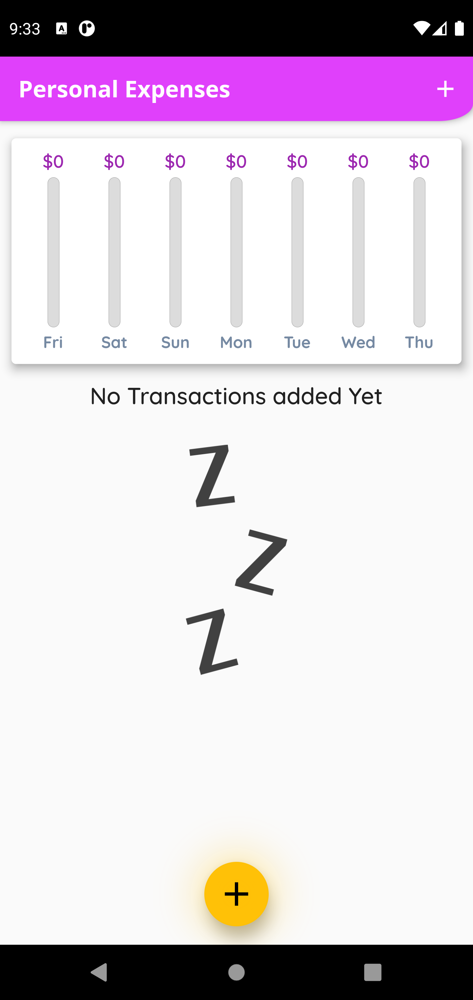
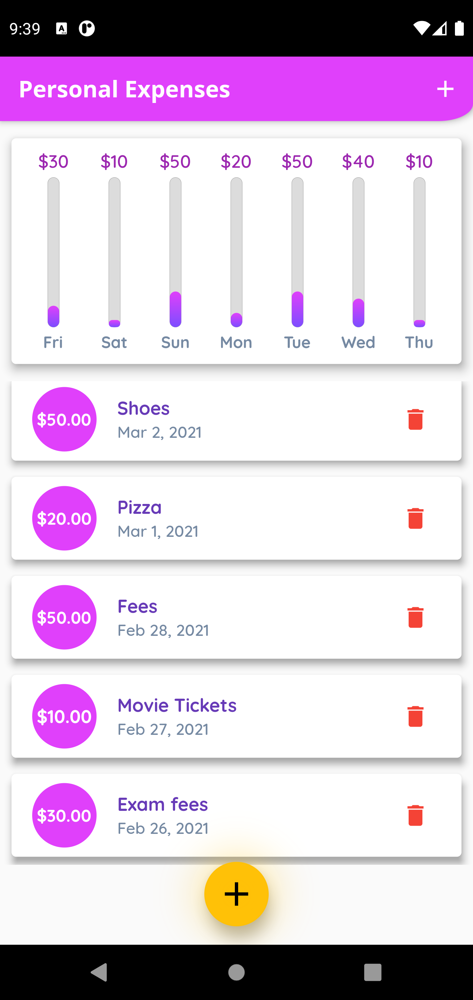
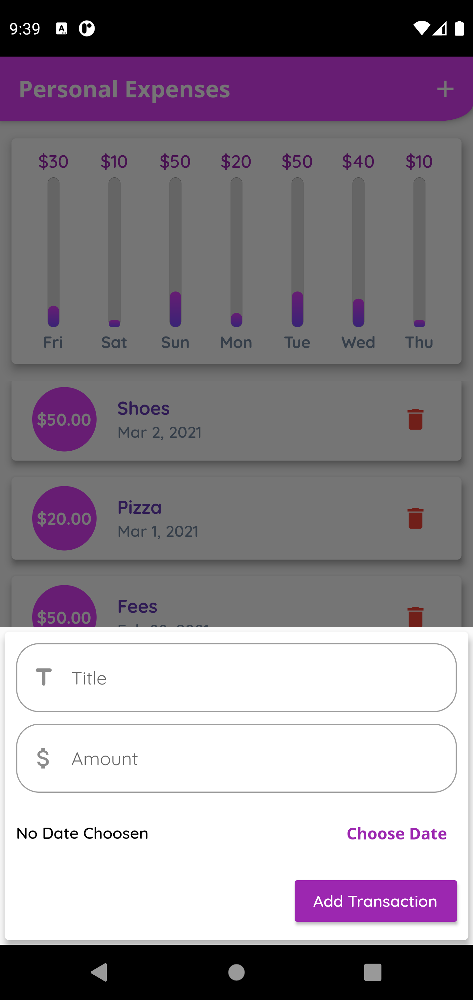
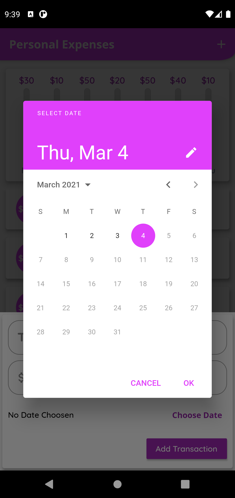

# personal_expenses

A Simple Personal Expense Manager Flutter App which allows you to Manage your daily Expenses With Features Such as Adding & Deleting Transaction , View Percentage Bar Chart Of Your Daily Expenses throughout the week and much more.

## Getting Started

For help getting started with Flutter, view our
[online documentation](https://flutter.dev/docs), which offers tutorials,
samples, guidance on mobile development, and a full API reference.

## ScreenShots 

